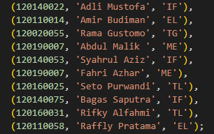
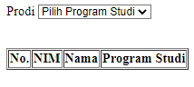
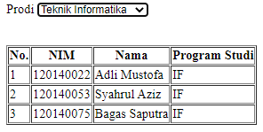

# Pertemuan 5
Tugas Praktikum Pemrogram Web Jadwal A Pertemuan 5

Adli Mustofa - 120140022

> Membuat aplikasi web yang dapat menampilkan data mahasiswa menggunakan dukungan AJAX saat pengguna melakukan perubahan pada pilihan program studi yang tersedia.
> - Aplikasi terhubung ke database yang memiliki tabel mahasiswa dengan minimal 3 data yaitu NIM, Nama, dan Program Studi.
> - Terdapat minimal 10 baris data mahasiswa.

Di bawah ini adalah hasil pekerjaan yang dilakukan

 Data Tabel 

Data yang saya buat berjumlah 10 data mahasiswa

 Tampilan Awal 

Data yang ditampilkan masih kosong karena belum memilih *opsi* program studi yang ada

 Proses Loading 

Tampilan ini saya buat agar penggantian data yang dipilih dapat terlihat dengan jelas

 Tampilan Akhir 

Data yang ditampilkan sesuai dengan opsi yang dipilih

